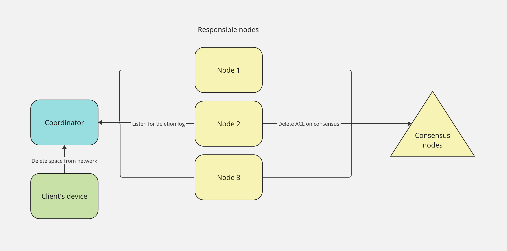

## Deletion Process Documentation

The following documentation outlines the process of initiating and handling the deletion of space within the network. This process involves various steps, messages, and actions taken by different nodes within the network.

- **Deletion command initiation:**
    - The deletion command is initiated on the client's side.
    - The command is then sent to the coordinator node for further processing.

- **Space removal duration:**
    - Upon receiving the deletion command, the space is scheduled for removal from the network.
    - The removal process is set to occur over a period of 30 days.

- **Deletion log and responsible nodes:**
    - The responsible nodes for the space receive messages from the deletion log.
    - These nodes sync the deletion log.

- **Deletion log: initial *RemovePrepare* message:**
    - When a responsible node receives the *RemovePrepare* message, the node takes action to prevent the space from being accessed or synced.

- **Deletion log: *Ok* message - user revocation within 30 days:**
    - During the 30-day removal period, the user has the option to revoke the deletion command.
    - If the user chooses to revoke, the space will continue syncing as before.

- **Deletion log: *Remove* message - completion of 30-day period:**
    - After the 30-day removal period expires, responsible nodes receive *Remove* message in the deletion log:
        - Storage for the space is cleared, preventing further access.
        - The deletion log is removed from the consensus nodes.

- **Notification of missing space:**
    - Following the completion of the deletion process, when we try to get the space we will get a "space is missing" error.

- **Attempts to re-add the space:**
    - If an attempt is made to push the same space to the coordinator an error message is generated, indicating that the space was previously deleted.

- **Future considerations:**
    - In the future, a force re-add mechanism can be implemented to reintroduce a previously deleted space.
