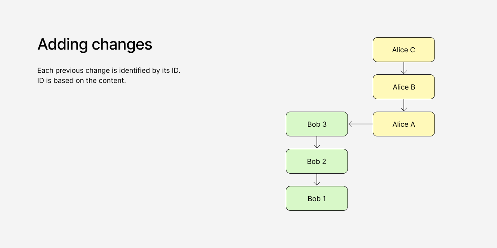
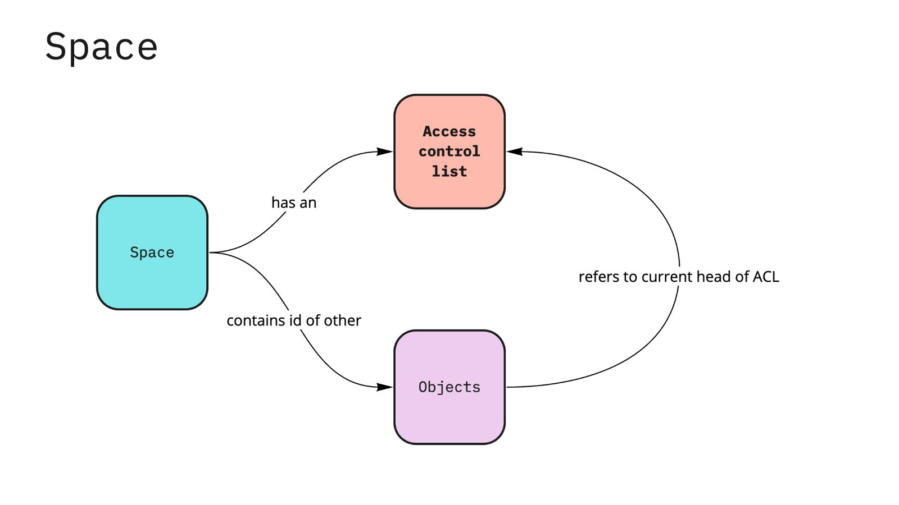
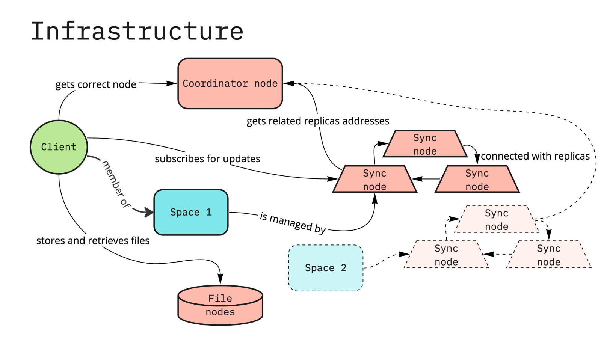

# Protocol overview

Any-Sync is an open-source protocol designed to create high-performance, local-first, peer-to-peer, end-to-end encrypted applications that facilitate seamless collaboration among multiple users and devices.

By utilizing this protocol, users can rest assured that they retain complete control over their data and digital experience. They are empowered to freely transition between various service providers, or even opt to self-host the applications.

This ensures utmost flexibility and autonomy for users in managing their personal information and digital interactions.

### Introduction

Most existing information management tools are implemented on centralized client-server architecture or designed for an offline-first single-user usage. Either way there are trade-offs for users: they can face restricted freedoms and privacy violations or compromise on the functionality of tools to avoid this.

We believe this goes against fundamental digital freedoms and that a new generation of software is needed that will respect these freedoms, while providing best in-class user experience.

Our goal with `any-sync` is to develop a protocol that will enable the deployment of this software.

Features:

* Conflict-free data replication across multiple devices and agents
* Built-in end-to-end encryption
* Cryptographically verifiable history of changes
* Adoption to frequent operations (high performance)
* Reliable and scalable infrastructure
* Simultaneous support of p2p and remote communication

### Protocol explanation

#### Data representation

_**Objects**_

`any-sync` is designed to synchronize digital objects that are structured as [Conflict-free Replicated Data](https://en.wikipedia.org/wiki/Conflict-free\_replicated\_data\_type) [Directed Acyclic Graphs](https://en.wikipedia.org/wiki/Directed\_acyclic\_graph) (DAGs). In this representation, each object is considered as a root, representing its initial state, and captures all the subsequent changes made to the object over time. Put simply, in `any-sync`, the objects serve as a comprehensive record of the complete history of the associated changes.

The changes, which don’t have changes after them, are object heads.

_**Conflict resolution**_

`any-sync` is specifically designed to support collaboration among multiple devices and agents, which can result in situations where objects have multiple "heads." In this context, a head refers to the local state of the object as observed by each device or agent involved.

When a user makes changes to an object that has multiple heads, the new change will incorporate and reference all of these heads. This process effectively "merges" several branches together, resulting in a unified and singular state for the object

During the process of retrieving the current state of an object, the protocol begins with a specific head and follows Content IDs (CIDs) to construct the sequence of changes. If there are multiple heads or several possible ways to identify the previous change, a topological sort is employed. This sort relies on the hash values associated with the changes to determine the order in which the changes occurred, ultimately establishing the correct sequence of changes.

_**Snapshots**_

To enhance the efficiency of retrieving the current state, the protocol employed by `any-sync` uses a probability-based mechanism that can transform a change into a snapshot. When a snapshot is created, there is no longer a need to analyze the changes that occurred before it in order to reconstruct the current state of the object. This optimization allows for faster retrieval by skipping the analysis of preceding changes when a snapshot is available.

`any-sync` is a protocol that is independent of specific client implementations, making it client-agnostic. It offers a mechanism to traverse objects, allowing applications to build their own application state based on the objects received through the protocol. In other words, applications using `any-sync` can utilize the objects received from it to construct their own internal state, tailored to their specific requirements and functionalities.

_**Files**_

`any-sync`'s file processing is a two-part solution: data storage and data retrieval.

It uses [IPLD](https://ipld.io/) data structures to store files' data. Files are stored locally on users' devices or on file-nodes on the external network, which means the protocol works with a simple network topology.

`any-sync` has its own approach for file retrieval, as opposed to [bitswap](https://docs.ipfs.tech/concepts/bitswap/), which is designed for networks with complex topologies.

_**Spaces**_

A Space is a collection of digital objects with an Access Control List (ACL), which allows the user to define who can read and modify its contents.

In the simplest scenario, each space holds the data of a single user, and this space can be accessed from multiple devices belonging to that user. However, in situations in which multiple agents are collaborating in the same space, the space stores data from and on the devices of each user who has access to it. In these cases, the permissions for accessing and managing the data within the spaces are determined by ACLs.

Spaces are stored locally on user’s devices or on sync nodes on the external network.

_**Encryption**_

Each user has private and public keys which are used for signing, encrypting, and decrypting.

`any-sync` uses the [Ed25519](https://en.wikipedia.org/wiki/EdDSA) algorithm for signing to provide strong cryptographic security, while still keeping the performance overhead low.

Every time a user modifies the data, the changes are both encrypted and signed using their own private key. When these changes are synchronized with other devices or sync-nodes, they are verified using a shared public key. However, only the user, who possesses the private key, can access the content of these changes.

#### Infrastructure

While `any-sync` works locally on user’s devices and in local p2p networks, an Infrastructure layer is needed to provide external data storage and backups, as well as seamless collaboration between agents in different networks.

`any-sync` protocol works the same way on the user’s devices and on the infrastructure side. So every node could be seen as a peer.

_**Nodes**_\
The infrastructure side consists of three types of nodes: sync nodes, file nodes, and a coordinator node.

* _Sync nodes_ store and process spaces. Each space is served by several sync nodes in order to increase the reliability of infrastructure.
* _File nodes_ store and process files based on IPLD data structure.
* _Coordinator node_ is responsible for storing and updating the infrastructure configuration: it manages the list of nodes, provides clients with addresses of nodes for spaces, provides nodes with addresses of replicas, etc.

_**Load distribution**_

[Load distribution](https://github.com/anyproto/go-chash) is implemented with a combination of modular hashing and consistent hashing. The algorithm distributes partitions (groups of spaces) between nodes using consistent hashing, then uses modular hashing to determine the partition for space (and thus the node for space).

The algorithm limits the load on a node, which makes distribution more or less even.

Adding a new node leads to the change of infrastructure configuration. This event starts the resharding process, when spaces and data within them are transferred between nodes according to the new configuration.

#### Peer retrieval

_**Local p2p**_

To find peers in the local network and communicate with them without connecting to external infrastructure, any-sync relies on [mDNS protocol](https://en.wikipedia.org/wiki/Multicast\_DNS).

User’s device sends an mDNS query asking for the IP address of devices with a specific hostname. Other devices on the network that have that hostname will respond with their IP address.

Once a client has the IP address of a peer device, any-sync tries to retrieve the spaces that exist on this device.

If the current user has access to spaces on a peer device (based on space ACL), then regular message interchange starts.

Files stored on a peer device can be retrieved directly from them as well.

This allows for efficient and direct communication between devices on the same network without the need for a remote server or internet connection.

_**Global networks**_

`any-sync` on the user's device stores a configuration with the address of external infrastructure. It requests a coordinator node for the address of the sync node, which is assigned to serve the user's space.

Once a client receives the address of the node for a space, it subscribes for updates and sends changes to it.

Files stored on the external infrastructure are retrieved from file nodes.

Moreover, a hybrid mode is possible if a user has two devices with any-sync in the same local network. Let’s say, the first device has access to external infrastructure, while the second device does not.

In this case, the first device acts as a bridge. It exchanges data with the local peer and translates changes made on the second device to the external storage.

It also works the other way: when the first device receives updates from the remote sync-node, it sends them to the second device via local p2p connection.

### Development background

The importance of developing and maintaining a completely new protocol was clear to us, and we made the decision after carefully considering existing solutions.

We evaluated the implementation of algorithms like RGA, Logoot, LSEQ, Automerge, and others. Although they share similar ideas regarding data representation, such as a logical ordering of object operations, they don't offer content identifiers and encryption schemes.

Additionally, they are designed to work with plaintext data, while any-sync relies on a binary format to support complex data structures.

We thus designed data structures that fit our requirements. Notably, none of the solutions mentioned support hybrid networking, which would require us to build something on top of them.

We also considered using IPFS, but its approach to content identifiers didn't meet our use cases. While IPFS could address our requirements for hybrid networking, it uses CID to describe documents, and this CID changes with each modification. However, we need documents to have stable identifiers for linking and other purposes.

Creating stable identifiers and implementing logic to merge different document states on top of IPFS would be too complex, so we chose a straightforward approach.

### Next steps

We are excited to announce the early development stage release of `any-sync` to the community.

In the upcoming phases of development, we have planned the following key features to be implemented:

* Full Access Control List (ACL) support for multiple agents: This enhancement will enable intricate collaboration scenarios by providing comprehensive control over access permissions and privileges among different agents involved in the synchronization process.
* Multiple service providers: We intend to introduce support for multiple service providers, facilitating seamless communication between diverse remote infrastructures. This feature will enhance interoperability and enable users to connect and collaborate across various infrastructure providers.
* Global peer-to-peer (p2p) communication: `any-sync` will be enhanced to enable direct communication and connection between devices without the need for a remote infrastructure. This advancement will empower users with the ability to establish direct p2p connections, fostering faster and more efficient data synchronization.

We are committed to continually improving `any-sync` and are thrilled to bring these exciting features to fruition in the near future, further enhancing its capabilities for the benefit of the community.
