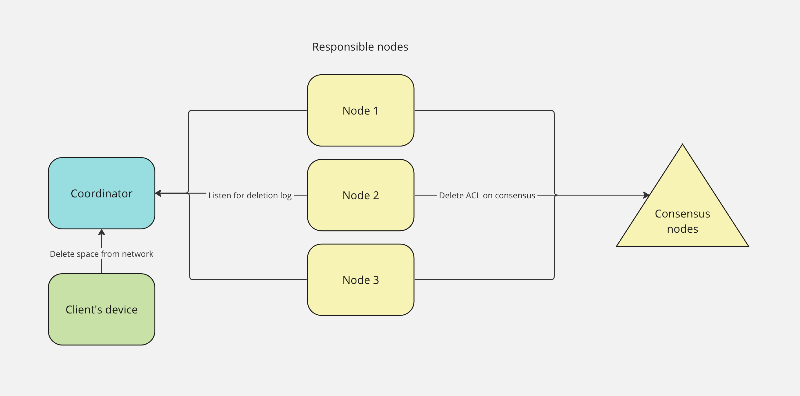

# Space Deletion

This documentation outlines the process of initiating and handling space deletion within the network. It involves multiple steps, messages, and actions performed by different network nodes.

## Deletion Command Initiation
The deletion command is initiated on the client's side.

The command is then sent to the coordinator node for further processing.

## Space Removal Duration
Upon receiving the deletion command, the space is scheduled for removal from the network.

The removal process is set to occur over a deletion period defined in a consensus node [configuration](configuration.md) (30 days by default).

## Deletion Log and Responsible Nodes
The responsible nodes for the space receive messages from the deletion log.

These nodes sync the deletion log.

### Initial `RemovePrepare` Message

When a responsible node receives the `RemovePrepare` message, the node takes action to prevent the space from being accessed or synced.

### `Ok` Message

During the deletion period (30 days by default), the user has the option to revoke the deletion command.

If the user chooses to revoke, the space will continue syncing as before.

### `Remove` Message
After the deletion period (30 days by default) expires, responsible nodes receive `Remove` message in the deletion log:
- Storage for the space is cleared, preventing further access.
- The deletion log is removed from the consensus nodes.

## Notification of Missing Space
Following the completion of the deletion process, when we try to get the space we will get a "space is missing" error.

## Attempts to Re-add the Space
If an attempt is made to push the same space to the coordinator an error message is generated, indicating that the space was previously deleted.

## Future Considerations
In the future, a force re-add mechanism can be implemented to reintroduce a previously deleted space.
